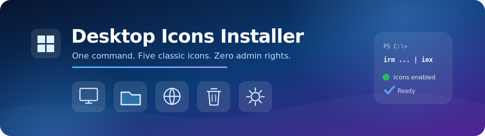

<div align="center">



<br>

[](https://www.microsoft.com/windows)
[](https://learn.microsoft.com/powershell/)
[](#how-it-works)
[](https://bygog.github.io/Windows-Desktop-Icons-Installer/install.ps1)

**Restore the classic Windows desktop icons with one PowerShell command.**<br>
**Klasik Windows masaüstü simgelerini tek PowerShell komutuyla geri getirin.**

[Türkçe](#-türkçe) · [English](#-english) · [View script](install.ps1)

</div>

---

## 🇹🇷 Türkçe

Windows'un sistem simgelerini Ayarlar menülerinde dolaşmadan masaüstüne ekler.

### Etkinleştirilen simgeler

| | Simge | Windows karşılığı |
|:--:|---|---|
| 🖥️ | **Bilgisayar** | This PC |
| 📁 | **Kullanıcı Dosyaları** | User's Files |
| 🌐 | **Ağ** | Network |
| ♻️ | **Geri Dönüşüm Kutusu** | Recycle Bin |
| ⚙️ | **Denetim Masası** | Control Panel |

### Hızlı kurulum

PowerShell'i açın, aşağıdaki komutu yapıştırın ve `Enter` tuşuna basın:

```powershell
irm https://bygog.github.io/Windows-Desktop-Icons-Installer/install.ps1 | iex
```

> [!TIP]
> Yönetici olarak çalıştırmanız gerekmez. Değişiklik geçerli Windows kullanıcısına uygulanır.

### Önce incelemek ister misiniz?

Çalıştırmadan yalnızca betik içeriğini görüntülemek için:

```powershell
irm https://bygog.github.io/Windows-Desktop-Icons-Installer/install.ps1
```

---

## 🇬🇧 English

Adds Windows system icons to your desktop without navigating through Settings menus.

### Icons enabled

| | Icon | Registry name |
|:--:|---|---|
| 🖥️ | **This PC** | Computer |
| 📁 | **User's Files** | User Files |
| 🌐 | **Network** | Network |
| ♻️ | **Recycle Bin** | Recycle Bin |
| ⚙️ | **Control Panel** | Control Panel |

### Quick install

Open PowerShell, paste the command below, and press `Enter`:

```powershell
irm https://bygog.github.io/Windows-Desktop-Icons-Installer/install.ps1 | iex
```

> [!TIP]
> Administrator privileges are not required. The change applies to the current Windows user.

### Want to inspect it first?

Display the script without executing it:

```powershell
irm https://bygog.github.io/Windows-Desktop-Icons-Installer/install.ps1
```

---

## How it works

The installer writes the five standard shell icon CLSIDs to both desktop icon visibility keys under the current user's registry:

```text
HKCU\Software\Microsoft\Windows\CurrentVersion\Explorer\HideDesktopIcons
```

Each icon is set to visible (`DWORD 0`), then Windows Explorer is notified to refresh the desktop. The script does not install software, download executables, or modify system-wide (`HKLM`) settings.

<div align="center">

Made for Windows · Powered by PowerShell

</div>
